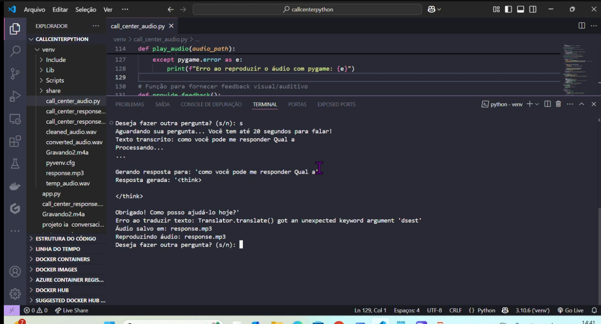
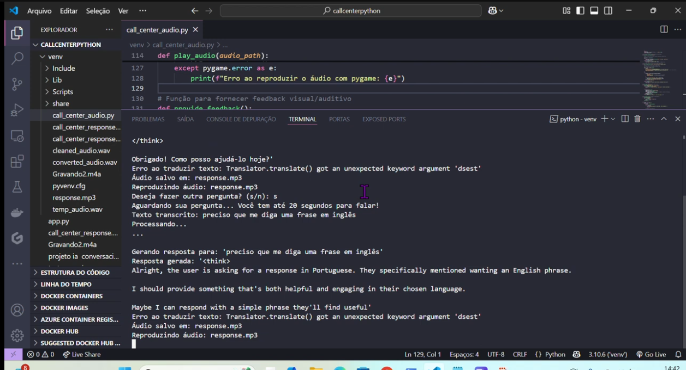

# Projeto de IA Conversacional

Este projeto implementa um sistema de IA conversacional em Python que utiliza reconhecimento de fala, um modelo de linguagem (via LM Studio) e conversão de texto em fala (Text-to-Speech) usando o Amazon Polly.

## Funcionalidades

*   **Reconhecimento de Fala (ASR):** Captura a pergunta do usuário via microfone e a transcreve para texto (usando `SpeechRecognition` e Google Speech Recognition).
*   **Geração de Resposta (LLM):** Envia a pergunta transcrita para um modelo de linguagem hospedado localmente (via LM Studio) para gerar uma resposta.
*   **Tradução:** Garante que a resposta gerada esteja em Português (usando `googletrans`).
*   **Conversão de Texto em Fala (TTS):** Converte a resposta de texto em um arquivo de áudio MP3 (usando Amazon Polly).
*   **Reprodução de Áudio:** Reproduz a resposta em áudio para o usuário (usando `pygame`).

## Demonstração

O projeto é baseado no código apresentado neste vídeo:

> **[Link do Vídeo](https://www.youtube.com/watch?v=-fzN_JXVrMs)**

### Capturas de Tela

Abaixo estão algumas capturas de tela do projeto em execução, mostrando a interação no terminal:

#### Exemplo de Interação 1



#### Exemplo de Interação 2



## Configuração e Instalação

### Pré-requisitos

1.  **Python 3.x**
2.  **LM Studio:** Para hospedar o modelo de linguagem localmente na porta `1234`. O código espera o modelo `deepseek-r1-distill-qwen-1.5b` ou similar.
3.  **Conta AWS:** Para usar o Amazon Polly (serviço de Text-to-Speech).

### Passos de Instalação

1.  **Clone o repositório:**
    ```bash
    git clone [URL_DO_REPOSITORIO]
    cd [NOME_DO_REPOSITORIO]
    ```

2.  **Crie um ambiente virtual (recomendado):**
    ```bash
    python3 -m venv venv
    source venv/bin/activate  # No Linux/macOS
    # venv\Scripts\activate   # No Windows
    ```

3.  **Instale as dependências:**
    ```bash
    pip install -r requirements.txt
    ```
    *Nota: A instalação do `pyaudio` pode exigir bibliotecas de sistema como `portaudio`.*

4.  **Configure as Variáveis de Ambiente:**
    Crie um arquivo `.env` na raiz do projeto e preencha com suas credenciais da AWS, baseando-se no arquivo `.env.example`:

    ```ini
    # .env
    AWS_ACCESS_KEY_ID="SUA_CHAVE_DE_ACESSO_AWS"
    AWS_SECRET_ACCESS_KEY="SUA_CHAVE_SECRETA_AWS"
    AWS_REGION="us-east-1"
    ```

5.  **Inicie o Servidor LM Studio:**
    Certifique-se de que o LM Studio esteja rodando e servindo o modelo de linguagem na URL `http://localhost:1234/v1/chat/completions`.

## Como Executar

Execute o script principal:

```bash
python conversational_ai.py
```

O programa irá:
1.  Pedir para você falar.
2.  Transcrever sua fala.
3.  Gerar uma resposta via LM Studio.
4.  Converter a resposta em áudio via Amazon Polly.
5.  Reproduzir o áudio.
6.  Perguntar se você deseja continuar.

## Contato

Desenvolvido por **Thiago Tavares**

*   **Email:** tavaresmirako@gmail.com
*   **LinkedIn:** [Thiago Tavares](https://www.linkedin.com/in/thiago-tavares-6328936a/)
*   **Portfólio:** [https://thportfolio.websys.tec.br/](https://thportfolio.websys.tec.br/)
